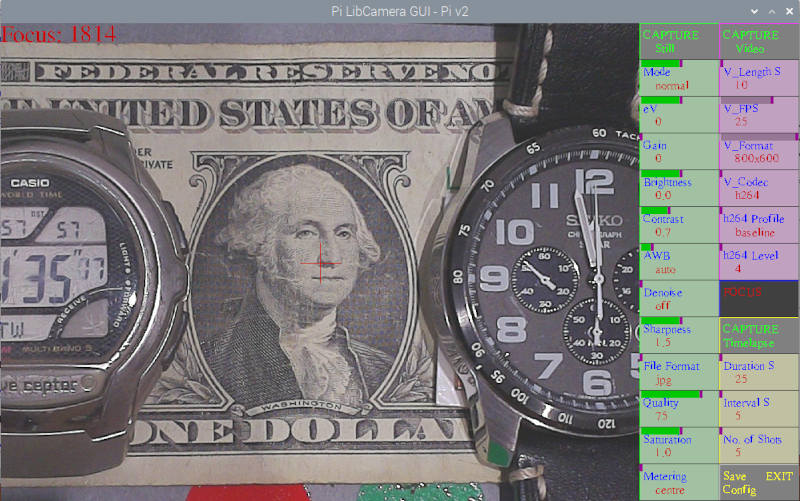

# Pi_LibCamera_GUI

To work with RaspiOS based on BULLSEYE, using libcamera (NOT raspistill/raspivid).
At your own risk !!. Ensure you have any required software backed up.

Script to allow control of a Pi Camera. Will work with all models, v1, v2 & HQ. 

Also Arducam 16MP and 64MP Autofocus. Click on FOCUS button to focus. This will show FOCUS MAN, which gives Manual Focusing, then click on 'slider' to adjust Manual Focus. lt will show a value for focus in the top left corner, adjust for a maximum. Click on FOCUS MAN to go back to auto focus. 2x2 binning option for 64MP camera, Click on right hand side of the Capture Still or Capture Timelapse buttons. 

For use with Hyperpixel square display set preview_width  = 720, preview_height = 540, sq_dis = 1 

Pi4B recommended.

Shows a reduced preview but saves stills at camera full resolution, and videos at user set resolution.

Can also save timelapses, set Interval to 0 for fast capture (uses libcamera-vid). If you want to capture high resolution images as fast as possible using Timelapse set Interval to 0, set Duration to required seconds, set V_FPS to max, set V_Coder to mjpeg, set V_Format to maximum value, click on CAPTURE Timelapse to start. The images will be in /home/.username./Pictures. If using Arducam 16MP or 64MP AF camera you will need more memory allocated to achieve full resolution if using Timelapse. In /boot/config.txt set dtoverlay=vc4-kms-v3d,cma-512 and then reboot. Note for fastest timelapse it uses libcamera-vid so not the highest quality images.

With a Pi HQ Camera will allow exposures upto 239 seconds. (Note v1 and v2 cameras limited to approx 1.1 seconds due to libcamera), Arducam 16 and 64mp cameras upto 200 and 435 seconds.

Click mouse on the left of a button to decrease, right to increase or use the appropriate slider

 # Always use the EXIT button to EXIT
 ( or you will need to reboot your pi)

# To install(manual):

Install latest RaspiOS based on Bullseye (tested with FULL 32bit and 64bit versions)
```bash
sudo apt install python3 -y
python3 -m pip install -U pygame --user
sudo apt install libsdl-gfx1.2-5 libsdl-image1.2 libsdl-kitchensink1 libsdl-mixer1.2 libsdl-sound1.2 libsdl-ttf2.0-0 libsdl1.2debian libsdl2-2.0-0 libsdl2-gfx-1.0-0 libsdl2-image-2.0-0 libsdl2-mixer-2.0-0 libsdl2-ttf-2.0-0 -y
sudo apt install python3-opencv -y
```
Let's download **PiLibCameraGUI.py** to our home directory

```bash
curl -fsSL https://raw.githubusercontent.com/Gordon999/Pi_LIbCamera_GUI/main/PiLibCameraGUI.py -o ~/PiLibCameraGUI.py
```

Use the following commands to run it.
  
```bash
python3 ~/PiLibCameraGUI.py
```


# Auto Installation (Beta):

```bash
sh -c "$(curl -fsSL https://raw.githubusercontent.com/Gordon999/Pi_LIbCamera_GUI/main/install.sh)"
```

## Screenshot



