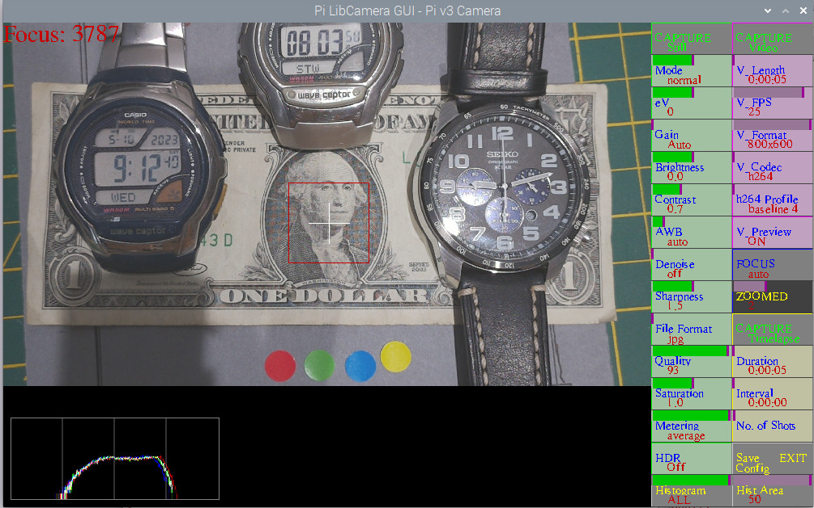

# Pi_LibCamera_GUI

# In development, therefore BETA, to work with RaspiOS based on BULLSEYE, using libcamera (NOT raspistill/raspivid).
# At your own risk !!. Ensure you have any required software backed up.

Script to allow control of a Pi Camera. Will work with all models, v1, v2 & HQ

Shows a reduced preview but saves stills at camera full resolution *, and videos at user set resolution *.

* Will save images and videos at preview size if zoom or focus button activated

With a Pi HQ Camera will allow exposures upto 239 seconds.

Click mouse on the left of a button to decrease, right to increase or use the appropriate slider

Always use the EXIT button to EXIT

Requires opencv installed  sudo apt-get install python3-opencv

To install:

Install latest RaspiOS based on Bullseye (tested with FULL 32bit version)

sudo apt install libsdl2-ttf-2.0-0

python3 -m pip install -U pygame --user

sudo apt install libsdl-gfx1.2-5 libsdl-image1.2 libsdl-kitchensink1 libsdl-mixer1.2 libsdl-sound1.2 libsdl-ttf2.0-0 libsdl1.2debian libsdl2-2.0-0 libsdl2-gfx-1.0-0 libsdl2-image-2.0-0 libsdl2-mixer-2.0-0 libsdl2-ttf-2.0-0

sudo apt install python3-opencv

Download PiLibCameraGUI.py and copy to /home/pi

## Screenshot

